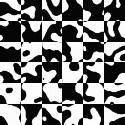

# ChimeraState
KuramotoModelの実装2  
論文は[Coexistence of synchrony and incoherence in oscillatory media under nonlinear global coupling](http://arxiv.org/abs/1312.3166)を参照.  
OpenCVで行列計算を行い,openMPで並列計算を実行  
以下のような画像画像ファイルとtxtファイルを出力する  

